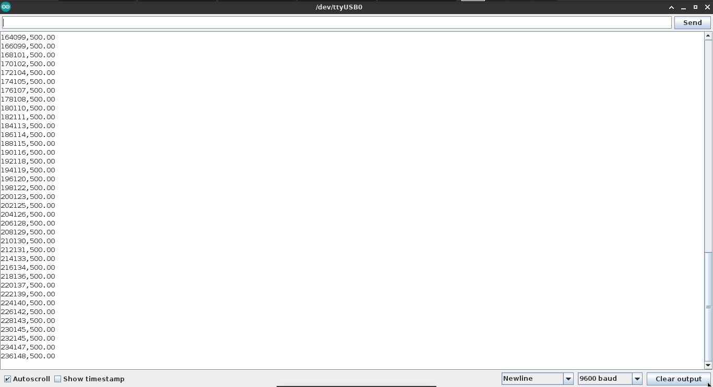
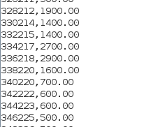

# MQ-2 Sensor Gas Calibration 

- MQ-2 sensing at normal condition


- MQ-2 sensing at gas target 


Arduino code program for result MQ-2 calibration using Regression Linear based MQ-2 Datasheet and output result as PPM (Part per Million). 
this project use arduino uno microcontroller with 1023 ADC reference and 5.0 VDC, and sensor (MQ-2) with RL 10k ohm (can see resistor back at PCB sensor) and R0 is sensing resistance at clean air condition.
and test subject for MQ-2, use LPG (Liquefied Petroleum Gas) or iso-butene/ 2-Methylpropene C4H8.

---

## Why must calibration sensor ?
while I school and learn IoT system from real case, sensor its very risk return unexpected result (out of range, etc).
sensor can return error result, it cause much factor and condition from different condition while sensing, environtment, temperature and humidity condition and more can cause error while sensor sensing a target.
thats why sensor should calibrate at new environtment for makesure sensor can sensing stable and at least 80 - 90% return stable result.

---

## Variable Description & Configuration
- MQ2pin : Pin Configuration (Analog Pin Only) (change if use another pin)
- minTreshold & maxTreshold : Minimum and Maximum treshold gas (change if use another gas, check MQ-2 Datasheet /calibrateResult/MQ2datasheet.pdf file)
- airreference : ppm reference for O2 (9.8 based datasheet, if have comparation proper device, change this value from proper device for O2 ppm)   
- slope (m) : Linear regression slope / m 
- intercept (c) : Linear regression intercept /c 
- adcBitReference : ADC reference (makesure change this adc if using another microcontroller, see microcontroller documentation ADC reference)
- Vcc : DC board voltage (5.0 VDC recommendation)  
- RL : Load resistor (many manufacture already fixed RL at board makesure check resistor at back sensor board)
- R0 : Sensing resistor at clean air, run getR0(readAnalog) for get R0 value (see information function at Function Description section)

---

## How calibration MQ-2 sensor
Note : for MQ-2 RL value, airReference (O2 PPM), minmaxThreshold, and Typical sensitivity curve, follow Datasheet and PCB wiring diagram

Makesure : 
- Check PCB board sensor for find RL (Load Resistor), many manufacture fixed RL resistor, check PCB wiring for find RL
- Check Microcontroller ADC reference, check your microcontroller ADC reference, because sensor read analog value, make sure used correct ADC reference
- Use 5 VDC for Vcc (sensor work voltage) 

Calibration : 
- Preheat 30 Minutes
- get slope and intercept from datasheet (if use another target gas)
- (if use another gas) replace new slope and intercept at define
- Run getR0() function for get R0 at 10 Minutes, and average all value, and place at R0 variable
- After get R0, Run getPPM() function for get PPM 

---

## Function Description

  ```cpp
  float getR0(long readAnalog) 
  ```

  return resistance clean air condition (R0), **long readAnalog** parameter based analog read function.
  preheat sensor at 30 minute and use getR0 function at 10 minute.

  ```cpp
  long getPPM(long readAnalog, float R0)
  ```
  
  return sensing resistance gas target and return into PPM value, **long readAnalog** parameter based from analog read function, **float R0** parameter for R0.
  
---

## How use

Use mq2gascode.ino for try sensor  

  ```cpp
   // place this code at loop() 
   
   sensorValue = analogRead(MQ2pin);

   // get R0 First (Recomment this for get R0)
   // float R0test = getR0(sensorValue);

   // after get R0, place R0 
   float R0data = getPPM(sensorValue, R0);
  
   Serial.print(millis());
   Serial.print(",");
   Serial.println(data);

   delay(2000);
  ```

